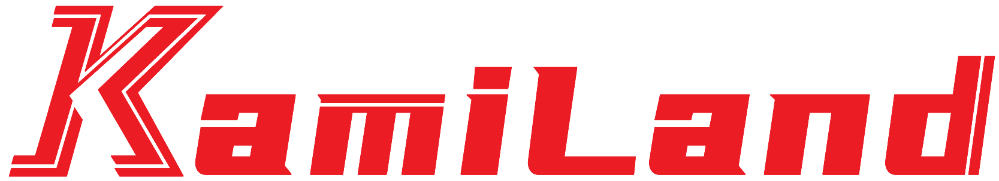

# KamiLand Network

KamiLand Network 是一个精英团队，专门从事 Minecraft 服务器等产品的创建和维护。我们的目标是通过科技创新，向广大用户提供更优质的电子游戏体验。

KamiLand Minecraft 服务器是团队的主要作品之一，我们倾力打造了这款高品质的服务器，提供低延时、优秀的网络防护、良好的反作弊机制以及优质的客户支持。

## 主要项目

- **KamiLand Minecraft 服务器**: 一个拥有低延迟、高防护、良好反作弊体系以及优秀客服支持的 Minecraft 服务器。服务器位于位于华中的 XXXX 机房，能为全国范围的玩家提供优质的网络服务。同时建立了玩家交流社区，使玩家们可以在游戏外共享游戏经验以及愉快的交流时光。

更多项目更新中...

## 团队成员

- **while1cry**: 创始人，因对 Minecraft 的深厚热爱而坚定打造优秀服务器的决心。始终以考虑玩家体验为出发点，他甚至自学 Java 编程为服务器开发付出巨大努力。

- **Arki**: 史，热爱原神的他，成为了一名不折不扣的原批。

> 更多成员的信息请访问 [KamiLand 网站](https://www.kamiland.net)。

## 联系我们

如果你有任何问题或建议，欢迎通过以下方式联系我们：

- [官方网站](https://www.kamiland.net)
- [电子邮件](mailto:admin@kamiland.net)
- [Kook社区](https://kook.top/tbf1or)

## 许可

除非另有说明，否则在此存储库中的所有代码都在 [MIT License](LICENSE) 下发行。
